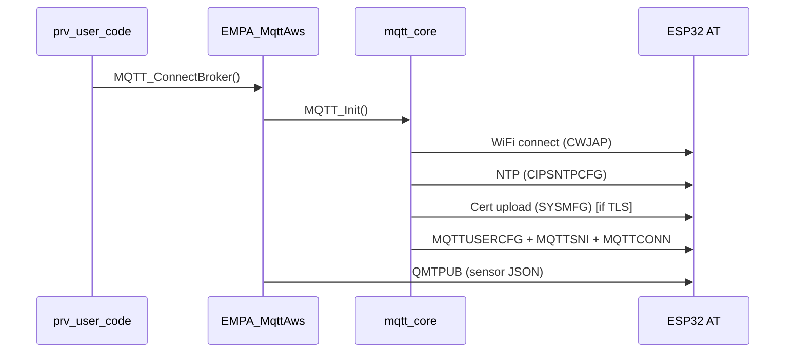
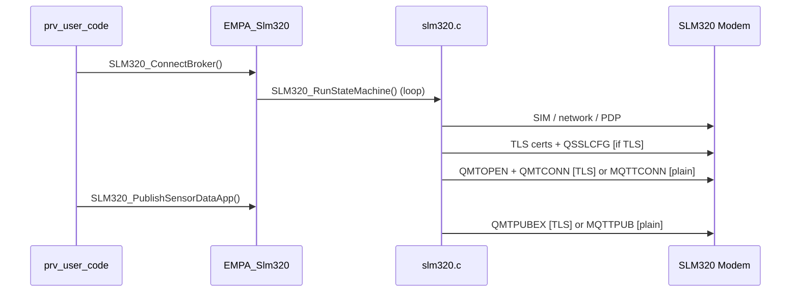

# Tiremo Connect — TmplUserApp

ABOV A34G43x (Cortex-M) firmware for Tiremo devices. Collects sensor data and can publish it to the **Tiremo MQTT broker** (`iot.tiremo.ai`).

The workshop firmware supports **three applications**, selected in `config/app_config.h`:

| # | Define | Description |
|---|--------|-------------|
| **1** | `EMPA_SENSOR_PROCESS` | Read sensors and print to debug UART (button start/stop cycle) |
| **2** | `EMPA_ESP32_MQTT_AWS` | WiFi via ESP32-C3 → MQTT/TLS |
| **3** | `EMPA_SLM320_4G` | 4G LTE via MeiG SLM320 → MQTT/TLS |

For the workshop, enable **only one** define at a time. Application 1 is active by default. Step-by-step flashing instructions: **[RunningCode.md](RunningCode.md)**.

Two independent connectivity paths are available for MQTT applications:

| Path | Module | Connection |
|------|--------|------------|
| **WiFi** | ESP32-C3 (AT firmware) | Local WiFi → MQTT/TLS |
| **4G LTE** | MeiG SLM320 | SIM / PDP → MQTT/TLS |

Both MQTT paths share the same broker settings and TLS certificates.

---

## Project structure

```
TmplUserApp/
├── prv_user_code.c          # Main application loop
├── user_uart_isr.c          # UART ISR (SLM320 on UART1, debug on UART0)
├── config/                  # All settings
│   ├── project_config.h     # Master include
│   ├── app_config.h         # Feature flags, timing
│   ├── board_config.h       # Pins, UART instances
│   ├── network_config.h     # WiFi, APN
│   └── mqtt_device_config.h # Broker, topics, TLS
├── certificates/            # Embedded .inc certificate data
└── Libraries/
    ├── cert_Lib/
    │   └── mqtt_certs.c/.h  # TLS certificate accessors
    ├── MQTT_Library/
    │   ├── mqtt_core.c/.h         # ESP32 AT MQTT state machine
    │   ├── mqtt_port_abov.c       # ABOV UART port layer
    │   └── EMPA_MqttAws.c         # WiFi + MQTT service layer
    ├── MEIG_SLM3XX/
    │   ├── slm320.c/.h            # SLM320 4G modem driver
    │   ├── EMPA_Slm320.c/.h       # 4G + MQTT service layer
    │   ├── README.md              # Driver overview
    │   └── SLM320_AT_Commands.md  # AT command reference
    ├── Sensor/                    # Sensor read + JSON formatting
    ├── SHT40/                     # Temperature / humidity
    ├── LISDE12TR/                 # Accelerometer
    └── MP23ABS1/                  # Microphone
```

---

## Feature selection (`config/app_config.h`)

Only **one** workshop application should be active at a time. Comment out the other two defines before building.

**Default (Application 1 — Sensor Process):**

```c
#define EMPA_SENSOR_PROCESS
//#define EMPA_ESP32_MQTT_AWS
//#define EMPA_SLM320_4G

#define APP_PUBLISH_INTERVAL_MS  2000U
```

| Flag | Behavior |
|------|----------|
| `EMPA_SENSOR_PROCESS` | Read sensors and print to debug UART. Button toggles measurement cycle on/off. No MQTT. |
| `EMPA_ESP32_MQTT_AWS` | WiFi + MQTT via ESP32. Certificates uploaded to ESP32 on first boot; erase from ABOV flash with 3 s button press. |
| `EMPA_SLM320_4G` | 4G + MQTT via MeiG SLM320. Same certificate workflow as ESP32. |

### Switching applications

1. Open `config/app_config.h`.
2. Uncomment the target define and comment out the other two.
3. For MQTT applications (2 and 3), set your unique `MQTT_DEVICE_NAME` in `config/mqtt_device_config.h`.
4. In eMStudio32: **Console → right-click → Terminate / Disconnect All**, then **Clean + Build**, then **Run**.

> ESP32 and SLM320 can technically be enabled together in code (different UARTs), but the workshop uses one application at a time.

---

## Broker and device settings

### Config files

| File | Contents |
|------|----------|
| `config/project_config.h` | Single include for all config |
| `config/app_config.h` | Feature flags, publish interval |
| `config/board_config.h` | LEDs, I2C, UART, modem pins |
| `config/network_config.h` | WiFi SSID/password, APN |
| `config/mqtt_device_config.h` | Broker, client ID, topics, TLS |

**Broker / device (`mqtt_device_config.h`):**

```c
#define MQTT_USER_ID          "hungarywp4qj"
#define MQTT_DEVICE_NAME      "hun20"

#define MQTT_CLIENT_ID        MQTT_USER_ID "_" MQTT_DEVICE_NAME   // hungarywp4qj_hun20
#define MQTT_BROKER_HOST      "iot.tiremo.ai"

#define MQTT_TOPIC_PUB        "pub/" MQTT_USER_ID "/" MQTT_DEVICE_NAME "/telemetry"
#define MQTT_TOPIC_ALARM      "pub/" MQTT_USER_ID "/" MQTT_DEVICE_NAME "/alarm"

#define MQTT_KEEP_ALIVE       60
#define MQTT_USE_TLS_CERTS    1    // 1 = TLS (8883), 0 = plain MQTT (1883)
```

### Parameter reference

| Define | Example | Used for |
|--------|---------|----------|
| `MQTT_USER_ID` | `hungarywp4qj` | Topic path, client ID prefix |
| `MQTT_DEVICE_NAME` | `hun20` | Topic path, client ID suffix |
| `MQTT_CLIENT_ID` | `hungarywp4qj_hun20` | MQTT CONNECT |
| `MQTT_BROKER_HOST` | `iot.tiremo.ai` | Broker address |
| `MQTT_TOPIC_PUB` | `pub/hungarywp4qj/hun20/telemetry` | Sensor data publish |
| `MQTT_TOPIC_ALARM` | `pub/hungarywp4qj/hun20/alarm` | Alarm publish |
| `MQTT_KEEP_ALIVE` | `60` | MQTT keep-alive (seconds) |
| `MQTT_USE_TLS_CERTS` | `1` | TLS on/off |
| `MQTT_BROKER_PORT` | `8883` / `1883` | Auto-selected from TLS flag |

### Adding a new device / user

1. Change `MQTT_USER_ID` and `MQTT_DEVICE_NAME` in `mqtt_device_config.h`.
2. Download certificates from the broker panel for the new device.
3. Update the embedded certificate files under `certificates/`:
   - `mqtt_rootCA.inc`
   - `mqtt_certificate.inc`
   - `mqtt_private.inc`
4. Build and flash.

---

## TLS certificates

### First-boot provisioning (ESP32 / SLM320)

On the first run of Application 2 or 3, TLS certificates embedded in ABOV code-flash are uploaded to the modem (ESP32 or SLM320). The terminal then prompts:

```
[CERT] Press and hold the button for 3+ seconds to erase the certificates stored in ABOV flash
```

Hold the user button for **3 seconds** (`APP_BTN_LONG_PRESS_MS`) to erase certificates from ABOV flash. After that:

- A board reset will **not** re-trigger certificate upload.
- MQTT connections use the certificates stored inside the modem.

### Enable / disable TLS

`mqtt_device_config.h`:

```c
#define MQTT_USE_TLS_CERTS    1   // Certificate-based connection (production)
#define MQTT_USE_TLS_CERTS    0   // Plain MQTT on port 1883 (test brokers only)
```

| Value | ESP32 | SLM320 |
|-------|-------|--------|
| **1** | Cert upload via `AT+SYSMFG`, port 8883 | `QFUPL` + `QSSLCFG` + `QMTOPEN`, port 8883 |
| **0** | Skip cert steps, `MQTT_TCP`, port 1883 | `AT+MQTTCONN` plain API, port 1883 |

> `iot.tiremo.ai` requires TLS. Use plain MQTT only with a local/test broker.

### Certificate files

| File | Description |
|------|-------------|
| `Libraries/cert_Lib/mqtt_certs.c` | Certificate accessor functions |
| `Libraries/cert_Lib/mqtt_certs.h` | `MqttCerts_GetRootCA()` etc. |
| `certificates/mqtt_rootCA.inc` | Root CA (embedded C string) |
| `certificates/mqtt_certificate.inc` | Client certificate (embedded C string) |
| `certificates/mqtt_private.inc` | Private key (embedded C string) |

ESP32 and SLM320 both use `MqttCerts_Get*()` functions.

---

## ESP32 (WiFi + MQTT) flow



### WiFi settings (`network_config.h`)

```c
#define WIFI_SSID       "EMPA_ARGE_4G"
#define WIFI_PASSWORD   "Empa1982"
#define WIFI_TIMEZONE   3
```

### Cellular settings (`network_config.h`)

```c
#define CELLULAR_APN        "internet"
#define CELLULAR_APN_AUTH   0
```

---

## SLM320 (4G + MQTT) flow



### SLM320 hardware

| Signal | Pin | Description |
|--------|-----|-------------|
| UART | `UART_ID_1` (PA10/PA11) | AT commands, 115200 8N1 |
| PWRKEY | PA7 | LOW ≥ 1 s → module powers on |
| PWR | PC4 | Module power supply enable |

### SLM320 driver logging

The driver logs only high-level milestones and errors on UART0 (debug). Raw modem RX responses are not printed.

Typical successful connect sequence:

```
[SLM320] SIM ready
[SLM320] Registered on network
[SLM320] PDP context active
[SLM320] TLS ready
[SLM320] MQTT broker open
[SLM320] MQTT broker connected
```

---

## Sensors and data format

`Sensor_ReadOnly()` reads all sensors; `Sensor_FormatJSON()` produces JSON.

| Sensor | Measurement |
|--------|-------------|
| SHT40 | Temperature, humidity |
| LIS2DE12 | Acceleration (X/Y/Z) |
| MP23ABS1 | Microphone RMS |
| ADC | Battery voltage |

Example JSON:

```json
{"temp":25.1,"hum":48.2,"bat":3.30,"ax":12,"ay":-5,"az":1001,"mic":1234}
```

Publish interval: **2 seconds** (`APP_PUBLISH_INTERVAL_MS`).

---

## Alarm system

Alarm publishing is active in MQTT applications (ESP32 and SLM320). Alarm checks are edge-triggered: the firmware publishes on fault entry and recovery.

- Detection API: `Sensor_PollAlarms(...)`
- Alarm JSON format: `Sensor_FormatAlarmJSON(...)`
- Alarm topic: `MQTT_TOPIC_ALARM` (`pub/<user>/<device>/alarm`)

Default thresholds (`Libraries/Sensor/sensor_alarm.h`):

| Alarm | Condition |
|-------|-----------|
| Temperature high | `temperature_mC > 30000` (30.0 °C) |
| Fall detected | `accel_z_mg <= 700` |
| Loud sound | `mic_rms > 2000` |

Publish flow in main loop:

1. Read sensor data.
2. Collect pending alarms (`pendingAlarmCount`).
3. Format each alarm as JSON.
4. Publish via `MQTT_PublishAlarm()` (ESP32) or `SLM320_PublishAlarm()` (4G).

---

## Hardware / UART summary

| UART | Usage |
|------|-------|
| UART0 | Debug terminal |
| UART1 (PA10/PA11) | SLM320 4G modem |
| UART2 (PA8/PA9) | ESP32-C3 AT |

I2C (PB6/PB7): SHT40, LIS2DE12.

---

## Build notes

- Project builds with **Eclipse + GCC** (`Build/Eclipse/TmplUserApp/`).
- `subdir.mk` files are auto-generated by Eclipse.
- Add new `.c` files via Eclipse Project Explorer.
- After structural changes, run **Clean + Build**.

---

## Quick troubleshooting

| Symptom | Likely cause |
|---------|--------------|
| MQTT timeout, cert upload | NTP not complete before TLS (ESP32) |
| CONNACK rejected | `MQTT_CLIENT_ID` does not match broker certificate/device |
| ESP32 WiFi fails | Wrong SSID/password in `network_config.h` |
| SLM320 QIACT error | SIM / APN / signal; APN is `internet` |
| `CME ERROR: 50` | `AT+MQTTCONN` used with TLS — use `QMTOPEN` path |
| `CME ERROR: 58` on publish | Use `AT+QMTPUBEX`, not `AT+QMTPUB` |
| TLS error | `MQTT_USE_TLS_CERTS=1` but certificate missing or expired |
| Port error | TLS on → 8883, off → 1883; must match broker |

---

## Related documents

| File | Contents |
|------|----------|
| [README.md](README.md) | This file — project overview |
| [RunningCode.md](RunningCode.md) | Workshop guide — build, flash, three applications |
| [Tiremo/README.md](Tiremo/README.md) | Firmware technical reference |
| [Libraries/MEIG_SLM3XX/README.md](Tiremo/Generation/AUDK32_A34xxxx-1.0.12/Example/Source/TmplUserApp/Libraries/MEIG_SLM3XX/README.md) | SLM320 driver overview |
| [Libraries/MEIG_SLM3XX/SLM320_AT_Commands.md](Generation/AUDK32_A34xxxx-1.0.12/Example/Source/TmplUserApp/Libraries/MEIG_SLM3XX/SLM320_AT_Commands.md) | SLM320 AT command reference |
| `config/project_config.h` | All settings (master) |
| `config/mqtt_device_config.h` | Broker / device / TLS |

---

*Tiremo Connect v2.0 — ABOV A34G43x*
