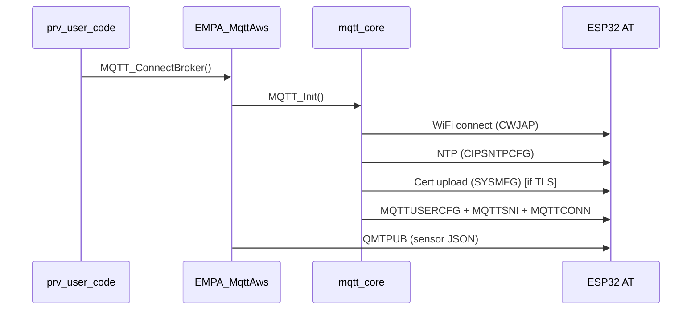
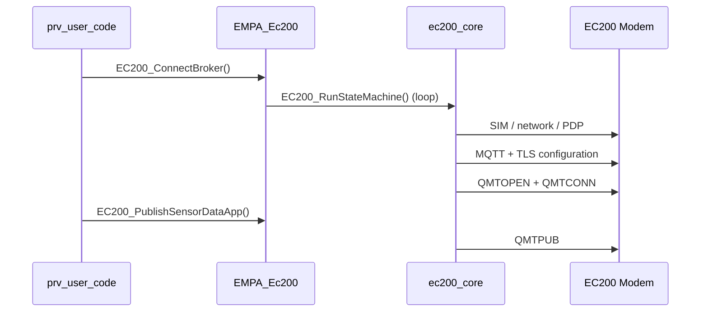

# Tiremo Connect — TmplUserApp

ABOV A34G43x (Cortex-M) firmware for Tiremo devices. Collects sensor data and publishes it to the **Tiremo MQTT broker** (`iot.tiremo.ai`).

Two independent connectivity paths are supported:

| Path | Module | Connection |
|------|--------|------------|
| **WiFi** | ESP32-C3 (AT firmware) | Local WiFi → MQTT/TLS |
| **4G LTE** | Quectel EC200 | SIM / PDP → MQTT/TLS |

Both paths share the same broker settings and (optionally) the same TLS certificates.

---

## Project structure

```
TmplUserApp/
├── prv_user_code.c          # Main application loop
├── user_uart.c              # UART setup (ESP32, EC200, debug)
├── config/                  # ★ All settings (single family)
│   ├── project_config.h     # Master include
│   ├── app_config.h         # Feature flags, timing
│   ├── board_config.h       # Pins, UART instances
│   ├── network_config.h     # WiFi, APN
│   └── mqtt_device_config.h # Broker, topics, TLS
├── certificates/            # PEM / .inc / .key certificate data
├── README.md                # This file
└── Libraries/
    ├── cert_Lib/
    │   └── mqtt_certs.c/.h  # TLS certificate accessors
    ├── MQTT_Library/
    │   ├── mqtt_core.c/.h         # ESP32 AT MQTT state machine
    │   ├── mqtt_port_abov.c       # ABOV UART port layer
    │   └── EMPA_MqttAws.c         # WiFi + MQTT service layer
    ├── EC200_4G/
    │   ├── ec200_core.c/.h        # 4G modem core (platform-independent)
    │   ├── ec200_port_abov.c      # ABOV HAL port layer
    │   ├── EMPA_Ec200.c/.h        # 4G + MQTT service layer
    │   └── EC200_AT_Commands.md   # EC200 AT command reference
    ├── Sensor/                    # Sensor read + JSON formatting
    ├── SHT40/                     # Temperature / humidity
    ├── LISDE12TR/                 # Accelerometer
    └── MP23ABS1/                  # Microphone
```

---

## Feature selection (`config/app_config.h`)

```c
//#define EMPA_SENSOR_PROCESS   // Print to terminal only
#define EMPA_ESP32_MQTT_AWS      // ESP32 WiFi + MQTT
//#define EMPA_EC200_4G          // EC200 4G + MQTT

#define APP_PUBLISH_INTERVAL_MS  2000U
```

| Flag | Behavior |
|------|----------|
| `EMPA_SENSOR_PROCESS` | Print sensor data to debug UART |
| `EMPA_ESP32_MQTT_AWS` | WiFi + MQTT via ESP32 |
| `EMPA_EC200_4G` | 4G + MQTT via EC200 |

ESP32 and EC200 can be enabled at the same time; both use `mqtt_device_config.h`.

---

## Broker and device settings

### Config files

| File | Contents |
|------|----------|
| `config/project_config.h` | Single include for all config |
| `config/app_config.h` | Feature flags, publish interval |
| `config/board_config.h` | LEDs, I2C, UART, EC200 pins |
| `config/network_config.h` | WiFi SSID/password, APN |
| `config/mqtt_device_config.h` | Broker, client ID, topics, TLS |

**Broker / device (`mqtt_device_config.h`):**

```c
#define MQTT_USER_ID          "hungarywp4qj"
#define MQTT_DEVICE_NAME      "Tiremo"

#define MQTT_CLIENT_ID        MQTT_USER_ID "_" MQTT_DEVICE_NAME   // hungarywp4qj_Tiremo
#define MQTT_BROKER_HOST      "iot.tiremo.ai"

#define MQTT_TOPIC_PUB        "pub/" MQTT_USER_ID "/" MQTT_DEVICE_NAME "/telemetry"
#define MQTT_TOPIC_SUB        "sub/" MQTT_USER_ID "/" MQTT_DEVICE_NAME "/telemetry"

#define MQTT_KEEP_ALIVE       60

#define MQTT_USE_TLS_CERTS    1    // 1 = TLS (8883), 0 = plain MQTT (1883)
```

### Parameter reference

| Define | Example | Used for |
|--------|---------|----------|
| `MQTT_USER_ID` | `hungarywp4qj` | Topic path, client ID prefix |
| `MQTT_DEVICE_NAME` | `Tiremo` | Topic path, client ID suffix |
| `MQTT_CLIENT_ID` | `hungarywp4qj_Tiremo` | MQTT CONNECT |
| `MQTT_BROKER_HOST` | `iot.tiremo.ai` | Broker address |
| `MQTT_TOPIC_PUB` | `pub/hungarywp4qj/Tiremo/telemetry` | Sensor data publish |
| `MQTT_TOPIC_SUB` | `sub/hungarywp4qj/Tiremo/telemetry` | Subscribe (ESP32) |
| `MQTT_KEEP_ALIVE` | `60` | MQTT keep-alive (seconds) |
| `MQTT_USE_TLS_CERTS` | `1` | TLS on/off |
| `MQTT_BROKER_PORT` | `8883` / `1883` | Auto-selected from TLS flag |
| `MQTT_CERT_FILE_PREFIX` | `hungarywp4qj_Tiremo` | PEM / `.inc` file prefix (no quotes) |

### Adding a new device / user

1. Change `MQTT_USER_ID` and `MQTT_DEVICE_NAME` in `mqtt_device_config.h`.
2. Download certificates from the broker panel for the new device.
3. Place PEM files under `certificates/`:
   - `<prefix>_rootCA.pem`
   - `<prefix>_certificate.pem`
   - `<prefix>_private.key`
   - `<prefix>` = `MQTT_CLIENT_ID` (e.g. `hungarywp4qj_Tiremo`)
4. Regenerate `.inc` files (included automatically by `mqtt_certs.c`).
5. Build and flash.

---

## TLS certificates

### Enable / disable

`mqtt_device_config.h`:

```c
#define MQTT_USE_TLS_CERTS    1   // Certificate-based connection
#define MQTT_USE_TLS_CERTS    0   // No certificates, port 1883
```

| Value | ESP32 | EC200 |
|-------|-------|-------|
| **1** | Cert upload via `AT+SYSMFG`, `MQTT_TLS_4`, port 8883 | `QFUPL` + `QSSLCFG`, port 8883 |
| **0** | Skip cert steps, `MQTT_TCP`, port 1883 | Skip SSL commands, port 1883 |

### Certificate files

| File | Description |
|------|-------------|
| `Libraries/cert_Lib/mqtt_certs.c` | Certificate accessor functions |
| `Libraries/cert_Lib/mqtt_certs.h` | `MqttCerts_GetRootCA()` etc. |
| `certificates/*.pem` | Raw certificate source |
| `certificates/*.inc` | Embedded C strings for build |

Both ESP32 and EC200 use `MqttCerts_Get*()` functions.

---

## ESP32 (WiFi + MQTT) flow



### WiFi settings (`network_config.h`)

```c
#define WIFI_SSID       "EMPA_Arge"
#define WIFI_PASSWORD   "Emp@Arg2024!"
#define WIFI_TIMEZONE   3
```

### Cellular settings (`network_config.h`)

```c
#define CELLULAR_APN        "internet"
#define CELLULAR_APN_AUTH   0
```

### ESP32 init steps (`mqtt_core.c`)

1. Module reset / AT check
2. Station mode
3. WiFi AP connection
4. NTP time sync
5. TLS certificate upload (`MQTT_USE_TLS_CERTS`)
6. `AT+MQTTUSERCFG` (scheme, client ID)
7. `AT+MQTTSNI` (if TLS enabled)
8. `AT+MQTTCONN` → broker

### Data publish

Main loop calls `MQTT_PublishSensorData()` → `Sensor_FormatJSON()` → `AT+MQTTPUBRAW` to `MQTT_TOPIC_PUB`.

---

## EC200 (4G + MQTT) flow



Detailed AT command list: **[Libraries/EC200_4G/EC200_AT_Commands.md](Libraries/EC200_4G/EC200_AT_Commands.md)**

### EC200 hardware

| Signal | Pin | Description |
|--------|-----|-------------|
| UART | `UART_ID_1` | AT commands, 115200 8N1 |
| PWRKEY | PA7 | LOW ≥ 2 s → module powers on |
| QEC_PWR | PC4 | Power supply enable |

---

## Sensors and data format

`Sensor_ReadOnly()` reads all sensors; `Sensor_FormatJSON()` produces JSON.

| Sensor | Measurement |
|--------|-------------|
| SHT40 | Temperature, humidity |
| LIS2DE12 | Acceleration (X/Y/Z) |
| MP23ABS1 | Microphone RMS |
| ADC | Battery voltage |

Example JSON (approximate):

```json
{"temp":25.1,"hum":48.2,"bat":3.30,"ax":12,"ay":-5,"az":1001,"mic":1234}
```

Publish interval: **2 seconds** in the main loop (`APP_PUBLISH_INTERVAL_MS`).

---

## Hardware / UART summary

| UART | Usage |
|------|-------|
| UART0 | Debug terminal |
| UART2 (PA8/PA9) | ESP32-C3 AT |
| UART1 (PA10/PA11) | EC200 4G |

I2C (PB6/PB7): SHT40, LIS2DE12.

---

## Build notes

- Project builds with **Eclipse + GCC** (`Build/Eclipse/TmplUserApp/`).
- `subdir.mk` files are auto-generated by Eclipse; do not edit manually.
- Add new `.c` files via Eclipse Project Explorer.
- Certificate `.inc` files are included from `certificates/` via relative path in `mqtt_certs.c`.

---

## Quick troubleshooting

| Symptom | Likely cause |
|---------|--------------|
| MQTT timeout, cert upload | NTP not complete before TLS; `mqtt_timer` must count seconds |
| CONNACK rejected | `MQTT_CLIENT_ID` does not match broker certificate/device |
| ESP32 WiFi fails | Wrong SSID/password in `network_config.h` |
| EC200 QIACT error | SIM / APN / signal; APN is `internet` |
| TLS error | `MQTT_USE_TLS_CERTS=1` but certificate missing or expired |
| Port error | TLS on → 8883, off → 1883; must match broker |

---

## Related documents

| File | Contents |
|------|----------|
| [README.md](README.md) | This file — project overview |
| [Libraries/EC200_4G/EC200_AT_Commands.md](Libraries/EC200_4G/EC200_AT_Commands.md) | EC200 AT command reference |
| `config/project_config.h` | All settings (master) |
| `config/mqtt_device_config.h` | Broker / device / TLS |

---

*Tiremo Connect v2.0 — ABOV A34G43x*
