# Running the Project — Workshop Guide

This guide walks you through downloading the Tiremo® Accelerator Workshops repository, opening the firmware project in **eMStudio32**, building and flashing the code to your **Tiremo®Cortex** board, and viewing debug output on a serial terminal.

> **Prerequisites:** Complete the [Development Environment Setup](../SetUp.md) before starting this activity.

---

## Table of Contents

1. [Download the Repository](#1-download-the-repository)
2. [Extract the Project](#2-extract-the-project)
3. [Open the Project in eMStudio32](#3-open-the-project-in-emstudio32)
   - [Launch eMStudio32](#31-launch-emstudio32)
   - [Select Workspace](#32-select-workspace)
   - [Import the Project](#33-import-the-project)
   - [Select Project Directory](#34-select-project-directory)
4. [Build and Flash via IDE](#4-build-and-flash-via-ide)
5. [Flash via Binary (aFlasher32)](#5-flash-via-binary-aflasher32)
6. [View Debug Messages (Tera Term)](#6-view-debug-messages-tera-term)

---

## 1. Download the Repository

Clone or download the workshop repository from GitHub:

**Repository:** [https://github.com/Empa-Electronics/Tiremo-Accelerator-Workshops-Secure-IoT](https://github.com/Empa-Electronics/Tiremo-Accelerator-Workshops-Secure-IoT)

You can use **Code → Download ZIP** or clone with Git:

```bash
git clone https://github.com/Empa-Electronics/Tiremo-Accelerator-Workshops-Secure-IoT.git
```

---

## 2. Extract the Project

After downloading, extract the ZIP archive to a folder on your computer. You should see the project structure including the `Project`, `Binary`, and `Document` folders.

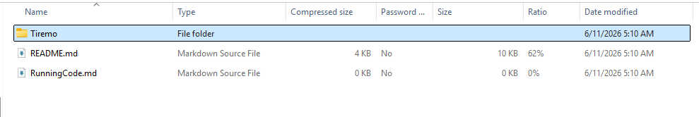

---

## 3. Open the Project in eMStudio32

### 3.1 Launch eMStudio32

Open the **eMStudio32** integrated development environment (IDE).

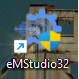

### 3.2 Select Workspace

When prompted, choose your workspace folder and click **Launch**.

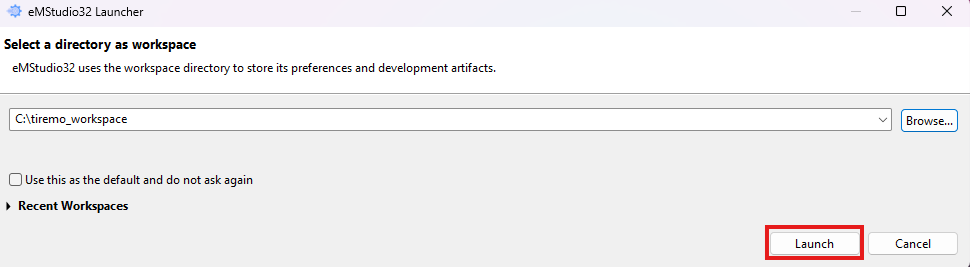

### 3.3 Import the Project

In the top toolbar, click the **ABOV** button.

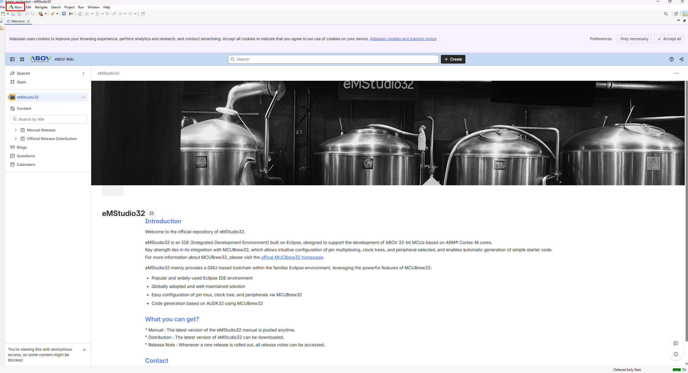

From the menu, select **Open eMStudio32 Project**.

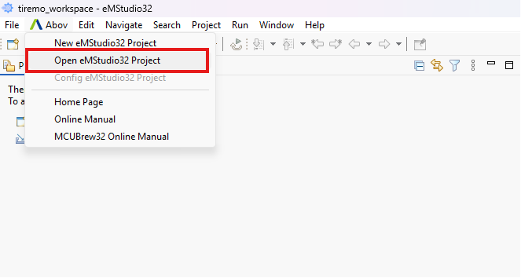

### 3.4 Select Project Directory

In the dialog that opens, click **Directory** and navigate to the Eclipse workspace path for the template user application:

```
..\Tiremo\Generation\AUDK32_A34xxxx-1.0.12\Example\Build\Eclipse\TmplUserApp\Workspace\tmpl_userapp
```

Relative to the extracted `Project` folder, the full path is:

```
Project\Tiremo\Generation\AUDK32_A34xxxx-1.0.12\Example\Build\Eclipse\TmplUserApp\Workspace\tmpl_userapp
```

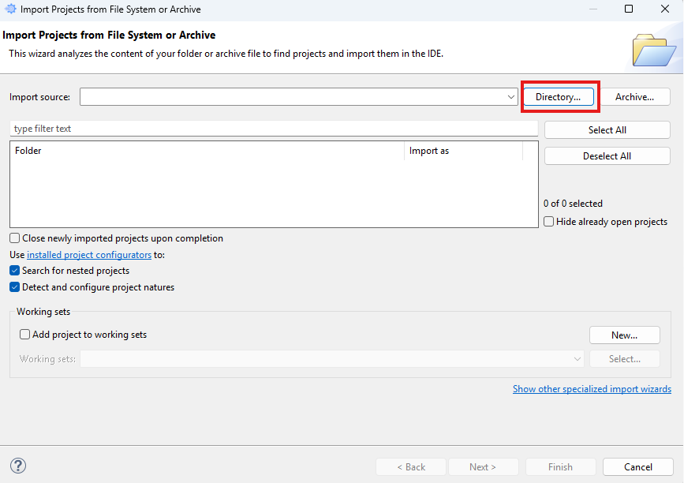

Click **Finish** to import the project.

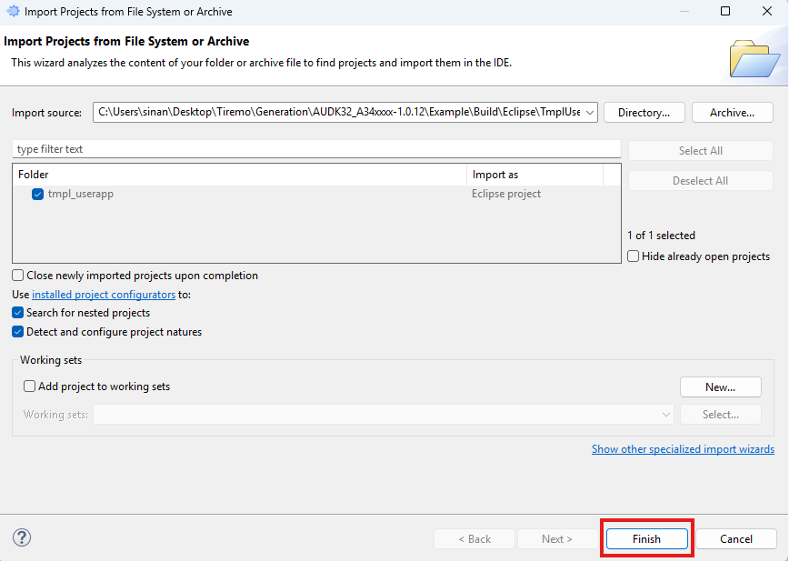

---

## 4. Build and Flash via IDE

### Connect the board

Connect a **USB Type-C** cable to the **CN6** connector on your Tiremo®Cortex board.

### Build the project

1. Right-click the project in **Project Explorer**.
2. Select **Build Project** and wait for the build to complete.

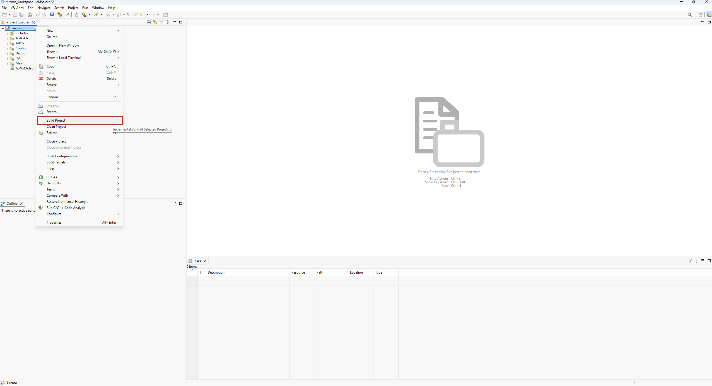

### Flash the firmware

1. Right-click the project again.
2. Select **Run As → Run Configurations…**
3. In the dialog, expand **GDB OpenOCD Debugging** and select **A34G43x**.
4. Click **Run** (bottom-right) to flash the firmware onto the board.

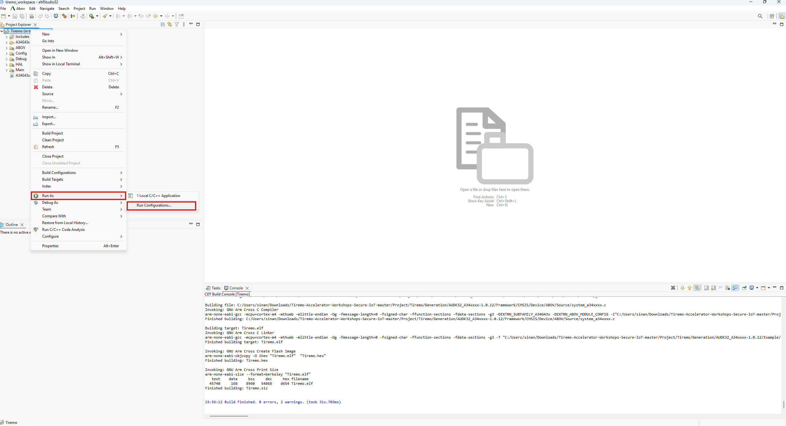

---

## 5. Flash via Binary (aFlasher32)

Instead of flashing from the IDE, you can load a pre-built **HEX** file directly using **aFlasher32**.

### Step 1 — Locate the HEX file

In the downloaded repository, open the `Binary` folder and extract the HEX file:

```
..\Tiremo-Accelerator-Workshops-Secure-IoT\Binary
```


### Step 2 — Open aFlasher32

Launch the **aFlasher32** application.

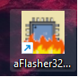

### Step 3 — Verify board connection

When the board is connected, a blue **aLinkUart2** message appears on screen — this confirms the connection.

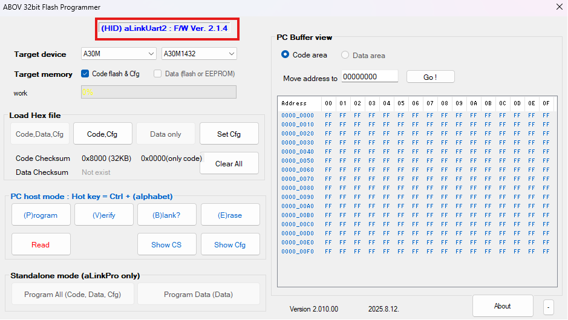

### Step 4 — Select target device

In the **Target Device** field, select your board's microcontroller model.

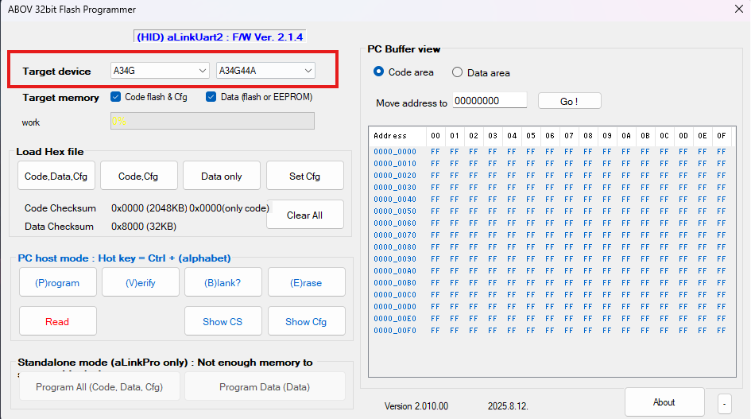

### Step 5 — Load the HEX file

Click **Code, Data, Cfg** and select the HEX file you extracted from the `Binary` folder.

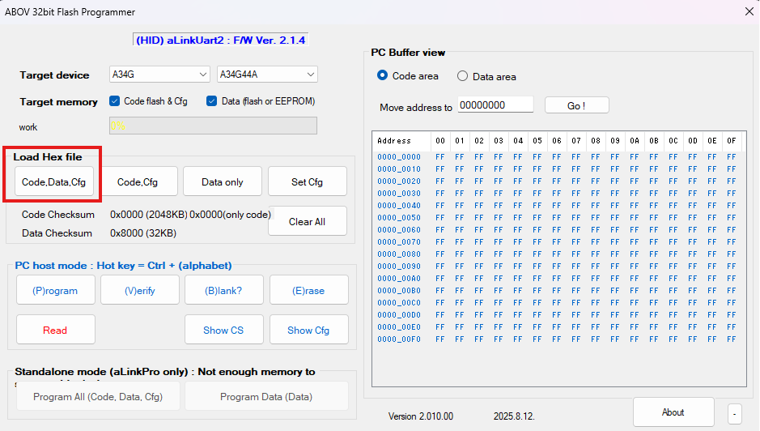

### Step 6 — Clear read protection

A **Read Protection** dialog appears. Keep the default option **Clear read protection** selected and click **OK**.

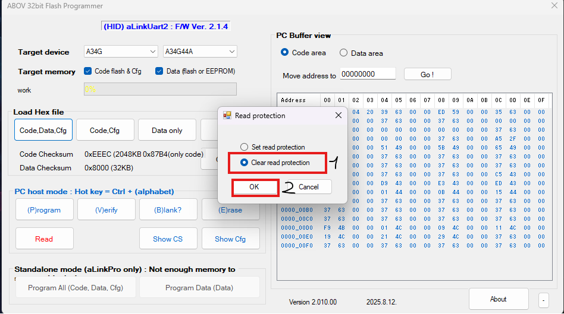

### Step 7 — Program the firmware

Click **Program** to flash the firmware onto the board.

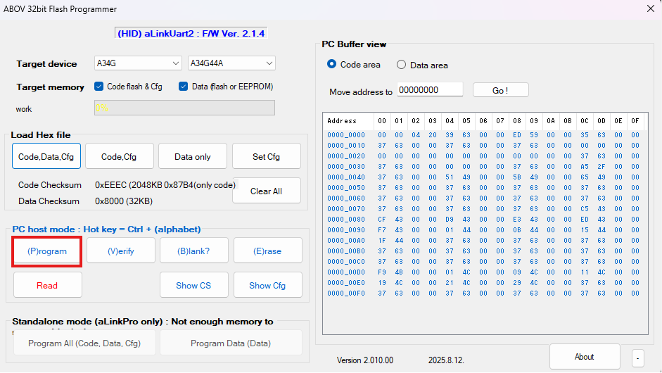

### Step 8 — Confirm success

When an **OK** message is displayed, the firmware has been loaded successfully.

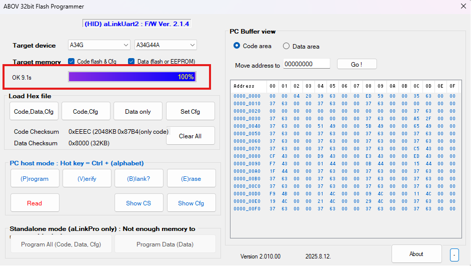

---

## 6. View Debug Messages (Tera Term)

To monitor debug output from the board, use your preferred serial terminal or **Tera Term** as shown below.

### Step 1 — Open Tera Term

Launch the **Tera Term** application.

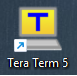

### Step 2 — Create a new connection

Go to **File → New connection**.

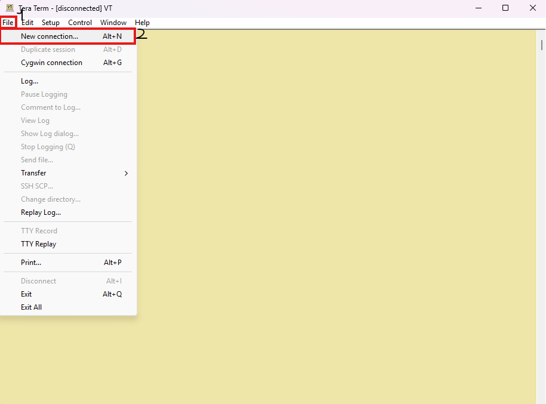

### Step 3 — Select the COM port

In the dialog, select the **COM port** assigned to your Tiremo®Cortex board.

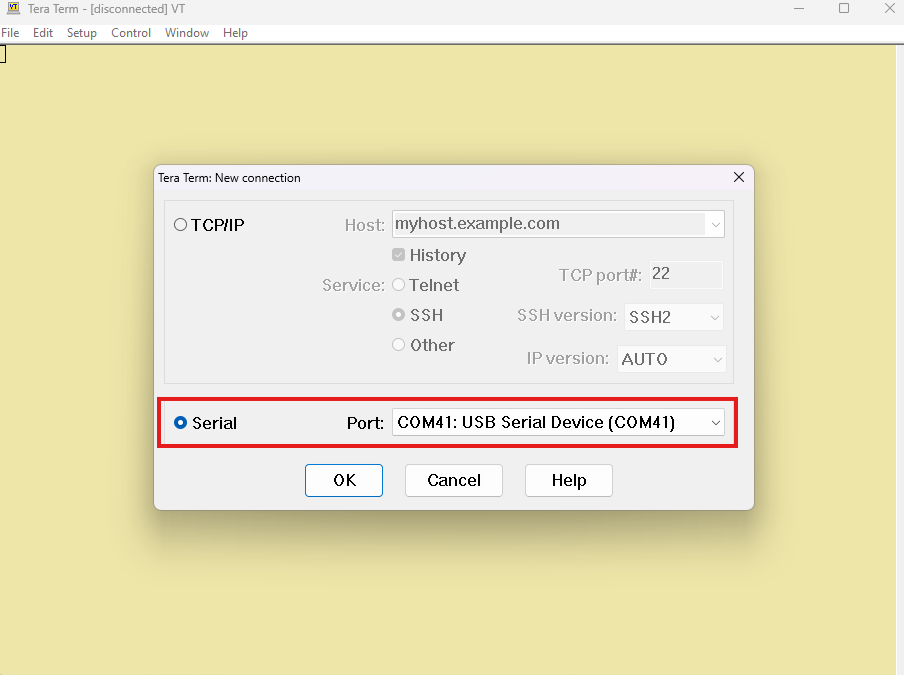

### Step 4 — Configure serial port settings

After connecting, go to **Setup → Serial port** in the toolbar. Configure the UART settings, then click **New setting** to open the terminal.

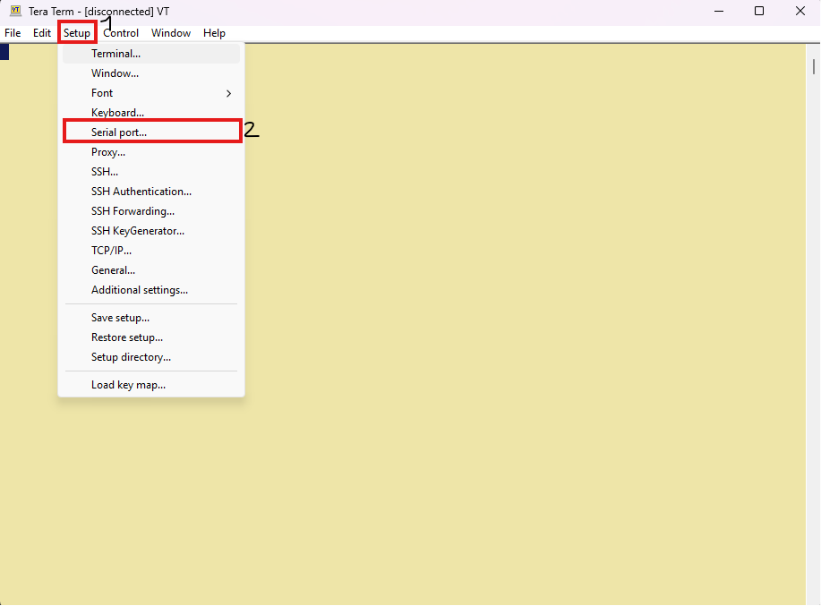

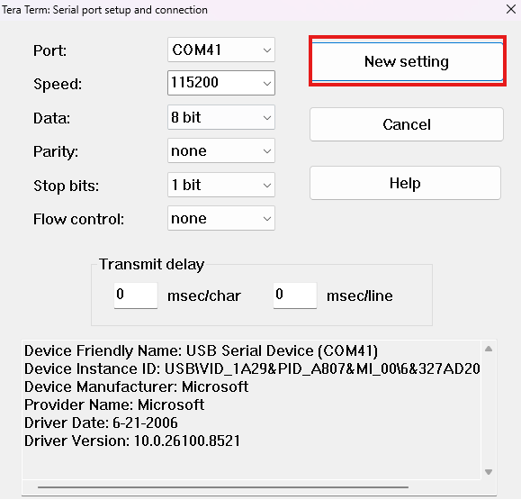

You can now watch debug messages from the firmware in real time.

---

## Next Steps

- Review the firmware source and MQTT configuration in [Project/README.md](README.md).
- Return to the [main workshop README](../README.md) for additional activities.

---

<p align="center">
  <sub>© Empa Electronics — Tiremo® Accelerator Workshops</sub>
</p>
