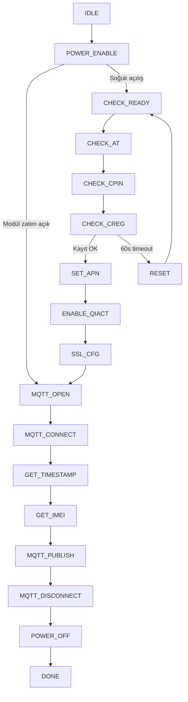

# EC200 AT Komutları Referansı

Bu doküman, `ec200.c` içindeki Quectel EC200 (BG95 uyumlu) sürücüsünün kullandığı AT komutlarını açıklar. Komutlar `EC200_RunStateMachine()` durum makinesi ve yardımcı fonksiyonlar üzerinden gönderilir.

**İlgili dosyalar**

| Dosya | Açıklama |
|-------|----------|
| `ec200.c` / `ec200.h` | Sürücü ve durum makinesi |
| `../certificates/mqtt_device_config.h` | Broker, client ID, topic, TLS bayrağı |

**Broker ayarları** (`mqtt_device_config.h`):

- Host: `MQTT_BROKER_HOST` → `iot.tiremo.ai`
- Client ID: `MQTT_CLIENT_ID`
- Publish topic: `MQTT_TOPIC_PUB`
- Port: `MQTT_BROKER_PORT` → TLS açıkken **8883**, kapalıyken **1883**
- TLS: `MQTT_USE_TLS_CERTS` → **1** = sertifikalı bağlantı, **0** = düz MQTT

---

## Durum makinesi akışı

Her `EC200_RunStateMachine()` çağrısı bir adım ilerler. Uygulama döngüsünde periyodik çağrılır.

---

## 1. Temel / hazırlık komutları

### `AT`

| Özellik | Değer |
|---------|-------|
| **Amaç** | Modülün canlı olup olmadığını kontrol etmek |
| **Kullanıldığı durum** | `POWER_ENABLE`, `CHECK_AT` |
| **Beklenen yanıt** | `OK` |

Soğuk açılışta modül hazır mı diye kontrol edilir. `POWER_ENABLE` içinde modül zaten yanıt veriyorsa tam açılış atlanır ve doğrudan MQTT yeniden bağlantısına geçilir.

---

### `AT+QPOWD=1`

| Özellik | Değer |
|---------|-------|
| **Amaç** | Modülü kontrollü kapatmak (graceful shutdown) |
| **Kullanıldığı fonksiyon** | `EC200_PowerOff()` → `POWER_OFF` |
| **Beklenen yanıt** | `POWERED DOWN` (en fazla ~65 s) |

Ardından donanım gücü kesilir (`QEC_PWR`).

---

## 2. Ağ ve SIM komutları

### `AT+QCFG="nwscanmode",0,1`

| Özellik | Değer |
|---------|-------|
| **Amaç** | Ağ tarama modunu AUTO (LTE + 3G + 2G) yapmak |
| **Kullanıldığı durum** | `CHECK_AT` |
| **Beklenen yanıt** | `OK` |

NVM'de kalmış GSM-only ayarını temizlemek için gönderilir.

---

### `AT+CPIN?`

| Özellik | Değer |
|---------|-------|
| **Amaç** | SIM kartın hazır olup olmadığını sorgulamak |
| **Kullanıldığı durum** | `CHECK_CPIN` (en fazla 5 deneme) |
| **Beklenen yanıt** | `+CPIN: READY` |

---

### `AT+CREG=0` ve `AT+CREG?`

| Özellik | Değer |
|---------|-------|
| **Amaç** | GSM şebeke kayıt durumunu okumak |
| **Kullanıldığı durum** | `CHECK_CREG` |
| **Başarı kriteri** | `+CREG:` içinde `,1` (home) veya `,5` (roaming) |
| **Timeout** | 60 saniye, 2 sn aralıkla tekrar |

Kayıt başarısız olursa `RESET` durumuna geçilir.

---

### `AT+CEREG?` / `AT+CGATT?` / `AT+QNWINFO`

| Komut | Amaç |
|-------|------|
| `AT+CEREG?` | LTE EPS kayıt durumu (teşhis) |
| `AT+CGATT?` | GPRS attach durumu (teşhis) |
| `AT+QNWINFO` | Aktif RAT ve operatör bilgisi (teşhis) |

**Kullanıldığı durum:** `ENABLE_QIACT` — PDP bağlamı açılmadan önce tanı amaçlı loglanır.

---

## 3. PDP bağlamı (veri bağlantısı)

### `AT+QICSGP=1,1,"internet","","",0`

| Özellik | Değer |
|---------|-------|
| **Amaç** | PDP context 1 için APN ayarlamak |
| **Kullanıldığı durum** | `SET_APN` |
| **APN** | `internet` |
| **Auth** | `0` (PAP/CHAP kapalı — kodda değiştirilmemeli) |

---

### `AT+QICSGP=1`

| Özellik | Değer |
|---------|-------|
| **Amaç** | Mevcut APN ayarını okumak (teşhis) |
| **Kullanıldığı durum** | `ENABLE_QIACT` |

---

### `AT+QIACT?`

| Özellik | Değer |
|---------|-------|
| **Amaç** | PDP context'in aktif olup olmadığını sorgulamak |
| **Kullanıldığı durum** | `ENABLE_QIACT` |
| **Hızlı geçiş** | Yanıtta `+QIACT: 1,1` varsa `QIACT` atlanır |

---

### `AT+QIDEACT=1`

| Özellik | Değer |
|---------|-------|
| **Amaç** | PDP context'i deaktive etmek (temiz başlangıç) |
| **Kullanıldığı durum** | `ENABLE_QIACT` |

---

### `AT+QIACT=1`

| Özellik | Değer |
|---------|-------|
| **Amaç** | PDP context 1'i aktive etmek (IP almak) |
| **Kullanıldığı durum** | `ENABLE_QIACT` |
| **Timeout** | 150 saniye |
| **Başarı** | `OK` |
| **Hata** | `ERROR` → `RESET` |

---

### `AT+QIDNSGIP=1,"<host>"`

| Özellik | Değer |
|---------|-------|
| **Amaç** | Broker DNS çözümlemesini doğrulamak |
| **Kullanıldığı durum** | `MQTT_CONNECT` (bağlantı başarılı olduktan sonra) |
| **Host** | `MQTT_BROKER_HOST` |
| **Beklenen URC** | `+QIURC: "dnsgip"` |

---

## 4. MQTT yapılandırma komutları

Tüm `QMTCFG` komutlarında ilk parametre **client index** = `0`.

### `AT+QMTCFG="ssl",0,<enable>[,<ctx>]`

| `MQTT_USE_TLS_CERTS` | Komut | Anlamı |
|----------------------|-------|--------|
| **1** | `AT+QMTCFG="ssl",0,1,2` | MQTT over SSL, SSL context **2** |
| **0** | `AT+QMTCFG="ssl",0,0` | SSL kapalı, düz TCP |

**Kullanıldığı durum:** `POWER_ENABLE` (sıcak yeniden bağlanma), `SSL_CFG`

---

### `AT+QMTCFG="version",0,4`

| Özellik | Değer |
|---------|-------|
| **Amaç** | MQTT protokol sürümü |
| **Değer** | `4` = MQTT v3.1.1 |

---

### `AT+QMTCFG="session",0,1`

| Özellik | Değer |
|---------|-------|
| **Amaç** | Clean session |
| **Değer** | `1` = her bağlantıda temiz oturum |

---

### `AT+QMTCFG="keepalive",0,<saniye>`

| Özellik | Değer |
|---------|-------|
| **Amaç** | MQTT keep-alive süresi |
| **Değer** | `MQTT_KEEP_ALIVE` (varsayılan **60** sn) |

---

## 5. TLS sertifika komutları

> Yalnızca `MQTT_USE_TLS_CERTS == 1` iken derlenir ve çalıştırılır.

### `AT+QFDEL="<dosya>"`

Eski sertifika dosyalarını UFS'ten siler:

| Dosya | İçerik |
|-------|--------|
| `cacert.pem` | Root CA |
| `client.pem` | İstemci sertifikası |
| `user_key.pem` | Özel anahtar |

---

### `AT+QFUPL="<dosya>",<uzunluk>,100`

| Özellik | Değer |
|---------|-------|
| **Amaç** | Dosyayı modül flash'ına yüklemek |
| **Akış** | 1) Komut gönder → `CONNECT` bekle → 2) PEM içeriğini gönder → `+QFUPL:` bekle |
| **Hata toleransı** | `+CME ERROR: 407` = dosya zaten var, yükleme atlanır |
| **Veri kaynağı** | `MqttCerts_GetRootCA()` / `GetClientCert()` / `GetPrivateKey()` |

---

### `AT+QSSLCFG` (SSL context 2)

| Komut | Açıklama |
|-------|----------|
| `AT+QSSLCFG="cacert",2,"cacert.pem"` | CA sertifikası |
| `AT+QSSLCFG="clientcert",2,"client.pem"` | İstemci sertifikası |
| `AT+QSSLCFG="clientkey",2,"user_key.pem"` | Özel anahtar |
| `AT+QSSLCFG="seclevel",2,2` | Sunucu + istemci doğrulama (mutual TLS) |
| `AT+QSSLCFG="sslversion",2,4` | TLS 1.2 |
| `AT+QSSLCFG="ciphersuite",2,0xFFFF` | Tüm desteklenen cipher'lar |
| `AT+QSSLCFG="ignorelocaltime",2,1` | Sertifika tarih kontrolünü gevşet |
| `AT+QSSLCFG="sni",2,1` | SNI etkin |

---

## 6. MQTT bağlantı komutları

### `AT+QMTOPEN=0,"<host>",<port>`

| Özellik | Değer |
|---------|-------|
| **Amaç** | MQTT sunucusuna TCP/TLS soketi açmak |
| **Kullanıldığı durum** | `MQTT_OPEN` |
| **Host** | `MQTT_BROKER_HOST` |
| **Port** | `MQTT_BROKER_PORT` (8883 veya 1883) |
| **Retry** | En fazla 3 deneme |
| **Beklenen URC** | `+QMTOPEN: 0,0` (result = 0 → başarılı) |

**URC hata kodları (result ≠ 0):**

| Kod | Anlamı |
|-----|--------|
| 1 | Parametre hatası |
| 2 | MQTT client meşgul |
| 3 | PDP başarısız |
| 4 | DNS hatası |
| 5 | Ağ bağlantısı yok |

---

### `AT+QMTCONN=0,"<client_id>"`

| Özellik | Değer |
|---------|-------|
| **Amaç** | MQTT CONNECT paketi göndermek |
| **Kullanıldığı durum** | `MQTT_CONNECT` |
| **Client ID** | `MQTT_CLIENT_ID` |
| **Timeout** | 60 saniye |
| **Başarı URC** | `+QMTCONN: 0,0` veya `+QMTCONN: 0,0,0` |

**CONNACK ret_code (0 dışındaki değerler):** broker bağlantıyı reddetmiş demektir.

---

### `AT+QMTCLOSE=0`

| Özellik | Değer |
|---------|-------|
| **Amaç** | Açık MQTT oturumunu kapatmak |
| **Kullanıldığı durum** | `POWER_ENABLE` (sıcak reconnect), `MQTT_OPEN` retry |

---

### `AT+QMTDISC=0`

| Özellik | Değer |
|---------|-------|
| **Amaç** | MQTT oturumunu düzgün sonlandırmak |
| **Kullanıldığı durum** | `MQTT_DISCONNECT` |
| **Beklenen URC** | `+QMTDISC: 0,0` |

---

## 7. MQTT publish

### `AT+QMTPUB=0,0,0,0,"<topic>",<uzunluk>`

| Özellik | Değer |
|---------|-------|
| **Amaç** | QoS 0 mesaj yayınlamak |
| **Fonksiyon** | `EC200_PublishSensorData()` |
| **Parametreler** | client=0, msgid=0, qos=0, retain=0 |
| **Topic** | Çağıran tarafından verilir (ör. `MQTT_TOPIC_PUB`) |
| **Akış** | 1) Komut → `>` prompt bekle → 2) payload gönder → `+QMTPUB:` URC bekle |

**Başarı URC:** `+QMTPUB: 0,0,0` veya `+QMTPUB: 0,0,1`

**Payload limiti:** en fazla 512 byte (kod kontrolü).

Hata durumunda `Ctrl+Z` (0x1A) gönderilerek işlem iptal edilir.

---

## 8. Bilgi sorgulama

### `AT+QLTS=1`

| Özellik | Değer |
|---------|-------|
| **Amaç** | Ağ saatini okumak |
| **Fonksiyon** | `EC200_GetTimestamp()` |
| **Beklenen yanıt** | `+QLTS: "yy/MM/dd,hh:mm:ss±tz"` |
| **Sonuç** | `ec200_unix_timestamp`, `ec200_timestamp_str` (+3 saat düzeltmesi uygulanır) |

---

### `AT+GSN`

| Özellik | Değer |
|---------|-------|
| **Amaç** | IMEI numarasını okumak |
| **Fonksiyon** | `EC200_GetIMEI()` |
| **Beklenen yanıt** | 15 haneli sayı + `OK` |
| **Sonuç** | `ec200_imei[]` |

---

## 9. Asenkron URC özeti

Sürücünün beklediği önemli URC'ler:

| URC | Ne zaman |
|-----|----------|
| `RDY` | Soğuk açılış sonrası modül hazır |
| `+QMTOPEN:` | MQTT socket açıldı / hata |
| `+QMTCONN:` | MQTT CONNECT sonucu |
| `+QMTSTAT:` | MQTT bağlantı reddi / kopma |
| `+QMTPUB:` | Publish sonucu |
| `+QMTDISC:` | Disconnect sonucu |
| `+QIURC: "dnsgip"` | DNS çözümleme sonucu |
| `CONNECT` | `QFUPL` dosya yükleme prompt'u |
| `POWERED DOWN` | `QPOWD` sonrası kapanma onayı |

---

## 10. Donanım notları

| Pin | İşlev |
|-----|-------|
| **PA7** (PWRKEY) | LOW ≥ 2 s → modül açılır |
| **PC4** (QEC_PWR) | Güç beslemesi enable |
| **UART** | `UART_ID_1`, 115200 8N1 (varsayılan) |

`EC200_UART_RxCallback()` UART kesmesinde tek byte alır; RX buffer `EC200_RX_BUF_SIZE` (4096 byte).

---

## 11. Hızlı referans tablosu

| Komut | Kategori | Durum / Fonksiyon |
|-------|----------|-------------------|
| `AT` | Temel | POWER_ENABLE, CHECK_AT |
| `AT+QPOWD=1` | Güç | PowerOff |
| `AT+QCFG="nwscanmode"...` | Ağ | CHECK_AT |
| `AT+CPIN?` | SIM | CHECK_CPIN |
| `AT+CREG=0` / `AT+CREG?` | Ağ | CHECK_CREG |
| `AT+QICSGP=...` | PDP | SET_APN, ENABLE_QIACT |
| `AT+QIACT?` / `AT+QIACT=1` / `AT+QIDEACT=1` | PDP | ENABLE_QIACT |
| `AT+CEREG?` / `AT+CGATT?` / `AT+QNWINFO` | Teşhis | ENABLE_QIACT |
| `AT+QMTCFG=...` | MQTT cfg | SSL_CFG, POWER_ENABLE |
| `AT+QFDEL` / `AT+QFUPL` | TLS dosya | SSL_CFG (TLS açık) |
| `AT+QSSLCFG=...` | TLS | SSL_CFG (TLS açık) |
| `AT+QMTOPEN` | MQTT | MQTT_OPEN |
| `AT+QMTCONN` | MQTT | MQTT_CONNECT |
| `AT+QMTCLOSE` | MQTT | POWER_ENABLE, MQTT_OPEN retry |
| `AT+QMTDISC` | MQTT | MQTT_DISCONNECT |
| `AT+QMTPUB` | MQTT | EC200_PublishSensorData |
| `AT+QIDNSGIP` | DNS | MQTT_CONNECT |
| `AT+QLTS=1` | Saat | EC200_GetTimestamp |
| `AT+GSN` | IMEI | EC200_GetIMEI |

---

*Son güncelleme: `ec200.c` sürücü implementasyonuna göre hazırlanmıştır.*
