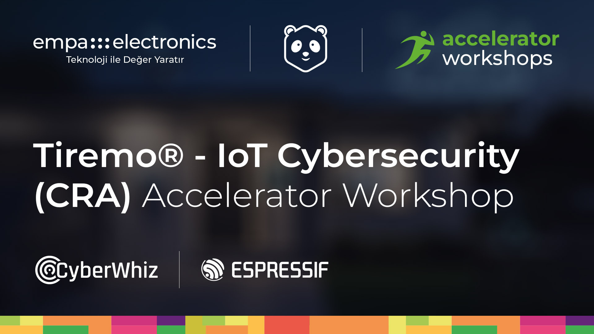

  

  

# Tiremo® Accelerator Workshops — Secure IoT

Welcome to the **Tiremo® Accelerator Workshops** by **Empa Electronics**. This repository contains firmware source, pre-built binaries, and step-by-step guides for the hands-on workshop.

---

## About Tiremo

**Tiremo** is a development board designed by Empa Electronics for Edge AI and cloud-IoT applications, delivered with full software support. At its core is the high-performance **ABOV A34G43ARL2N** microcontroller (ARM® Cortex®-M4F), together with an onboard debugger that simplifies your development workflow. The board includes an analog MEMS microphone, a 3-axis accelerometer, and temperature/humidity sensors for environmental monitoring. Ten user LEDs and a user button let you build rich visual interactions; a Wi-Fi and Bluetooth LE module connects your data to the cloud or to other devices. In this workshop, sensor data is sent to the **Tiremo MQTT broker** (`iot.tiremo.ai`) over Wi-Fi or 4G LTE. Connect via **USB Type-C (CN6)** for power, flashing, and serial debug.

Sensors convert physical events into electronic signals that can be analyzed at the edge or in the cloud. Lightweight protocols such as **MQTT** carry sensor data reliably with low bandwidth. Cloud IoT platforms collect, store, and visualize this data in a central system — enabling low-latency, energy-efficient applications when the right sensors and connectivity are chosen at the edge.

---

## Development Environment Setup

Before starting, install the required tools (eMStudio32, aFlasher32, Tera Term, etc.):

### ↳ [Development Environment Setup](SetUp.md)

---

## Workshop Activities

After setup, follow the activity guide to open the project, select an application, build, and flash the **Tiremo** board:

### ↳ [1) Data Collection and MQTT Communication with Tiremo](Project/RunningCode.md)

Three workshop applications are included: sensor readout to terminal, ESP32 WiFi MQTT, and SLM320 4G MQTT.

Firmware details: [Project/README.md](Project/README.md)

### ↳  2) CyberWhiz — Secure IoT on ESP32  

ESP-IDF project on **ESP32**: WiFi connection, TLS MQTT, and periodic **Secure Mercek** security telemetry to the cloud. Open `Project/CyberWhiz/` in VS Code with the ESP-IDF extension.  

---

  © Empa Electronics — Tiremo® Accelerator Workshops

