# Development Environment Setup

This guide covers the installation of all software tools required to participate in the **Tiremo® Accelerator Workshops** activities. Complete every installation below before starting the workshop.

---

## Table of Contents

- [System Requirements](#system-requirements)
- [Required Tools](#required-tools)
- [1. eMStudio32 Installation](#1-emstudio32-installation)
- [2. MCUBrew32 Installation](#2-mcubrew32-installation)
- [3. aFlasher32 Installation](#3-aflasher32-installation)
- [4. Tera Term Installation](#4-tera-term-installation)
- [5. Visual Studio Code Installation](#5-visual-studio-code-installation)
- [6. ESP-IDF Extension Setup (Recommended)](#6-esp-idf-extension-setup-recommended)
- [7. Alternative ESP-IDF Installation Methods](#7-alternative-esp-idf-installation-methods)
  - [7.1 Windows](#71-windows)
  - [7.2 macOS / Linux](#72-macos--linux)
- [8. Installation Verification](#8-installation-verification)
- [Useful Commands](#useful-commands)
- [Resources](#resources)

---

## System Requirements

### Windows
- Windows 10 or newer
- Minimum 4 GB RAM (8 GB recommended)
- At least 10 GB free disk space
- Internet connection

### macOS
- macOS 10.15 (Catalina) or newer
- Homebrew package manager
- Xcode Command Line Tools
- Minimum 4 GB RAM (8 GB recommended)
- At least 10 GB free disk space

### Linux
- Ubuntu 20.04 LTS or newer (Debian-based distributions)
- Minimum 4 GB RAM (8 GB recommended)
- At least 10 GB free disk space
- `sudo` privileges

---

## Required Tools

| Tool | Description |
|------|-------------|
| **eMStudio32** | Integrated development environment (IDE) for ABOV microcontrollers |
| **MCUBrew32** | Project creation and configuration tool |
| **aFlasher32** | Flash programming tool for loading binary files onto the board |
| **Tera Term** | Terminal emulator for serial port communication |
| **Visual Studio Code** | Recommended code editor for ESP32 development |
| **ESP-IDF v5.3** | Espressif IoT Development Framework for ESP32 projects |

---

## 1. eMStudio32 Installation

eMStudio32 is an integrated development environment (IDE) for ABOV microcontrollers. It lets you write, build, and debug code from a single interface.

### Resources

- 🌐 **Official Download Page:** [ABOV Tools & Support — eMStudio32](https://www.abov.co.kr/en/tools_support/debug_tools.php?category=eMStudio32)
- 📖 **User Manual:** [eMStudio32 Manual & Release Notes](https://abov.atlassian.net/wiki/spaces/ES2/pages/1558413356/Manual+Release)
- 📋 **Installation Steps:** [eMStudio32 Installation Guide](https://abov.atlassian.net/wiki/spaces/ES2/pages/1752858627/Installation)
- 📄 **Local Document:** [ES2 Installation (PDF)](Document/ES2-Installation-200526-125944.pdf)

### Installation Steps

1. Go to the official download page above and download the installer.
2. Run the downloaded installer.
3. Follow the steps in the [installation documentation](https://abov.atlassian.net/wiki/spaces/ES2/pages/1752858627/Installation) to complete setup.

---

## 2. MCUBrew32 Installation

MCUBrew32 is a tool for code generation and peripheral configuration in ABOV microcontroller projects.

### Resources

- 🌐 **Official Download Page:** [ABOV Tools & Support — MCUBrew32](https://www.abov.co.kr/en/tools_support/debug_tools.php?category=mcubrew32)
- 📖 **User Manual:** [MCUBrew32 User Guide](https://abov.atlassian.net/wiki/spaces/MCUBrew321/pages/760250452/Manual+Release)
- 📋 **Installation Steps:** [MCUBrew32 Installation and Getting Started](https://abov.atlassian.net/wiki/spaces/MCUBrew321/pages/1379565598/Installation+and+Getting+Started)
- 📄 **Local Document:** [MCUBrew32 Installation (PDF)](Document/MCUBrew321-Installing%20and%20uninstalling%20the%20MCUBrew32%20program-200526-123146.pdf)

### Installation Steps

1. Go to the official download page above and download the installer.
2. Run the downloaded installer and follow the setup steps.
3. Installation is complete when the **"Installation Complete"** screen appears at **step 6** of the installation guide.

---

## 3. aFlasher32 Installation

aFlasher32 is a flash programming tool used to load compiled binary files onto the **Tiremo®Cortex** board.

### Installation Steps

**Step 1 —** Go to [ABOV Tools & Support — aFlasher32](https://www.abov.co.kr/en/tools_support/debug_tools.php?category=aflasher32).

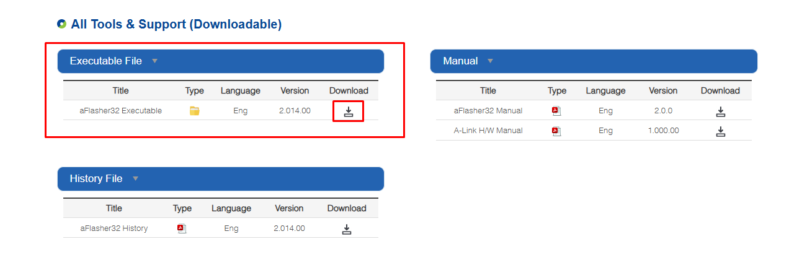

**Step 2 —** Under *All Tools & Support (Downloadable)*, download the **aFlasher32 Executable** `.exe` file from the **Executable File** column.

**Step 3 —** Extract the `.exe` installer from the downloaded `.zip` archive and run the setup program.

**Step 4 —** Complete the installation by following these steps:

**→** Click **Next** on the setup screen.

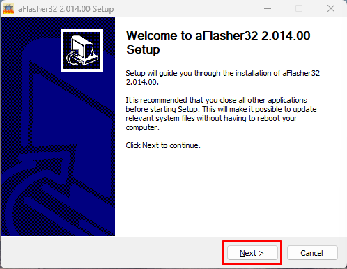

**→** Accept the license agreement.

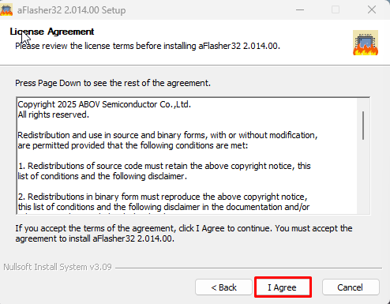

**→** Choose the installation location and click **Install**.

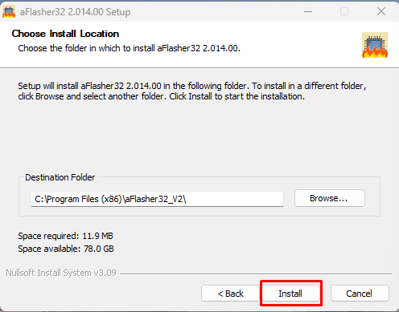

**→** Click **Finish** to complete the installation.

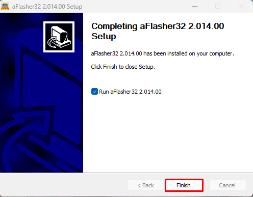

---

## 4. Tera Term Installation

Tera Term is a terminal emulator used to communicate with **Tiremo®Cortex** over a serial port. This workshop uses Tera Term; you may use any serial terminal application you prefer.

### Installation Steps

**Step 1 —** Go to [https://teratermproject.github.io/index-en.html](https://teratermproject.github.io/index-en.html).

**Step 2 —** Click the latest release under **Download**.

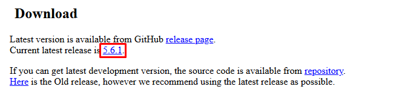

**Step 3 —** On the release page, download the installer from the **installer** section.

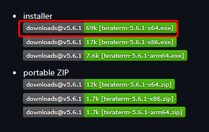

**Step 4 —** Run the downloaded `.exe` file and complete the installation.

---

## 5. ESP-IDF Installation

1. Download ESP-IDF v5.3 from https://github.com/espressif/idf-installer/releases/download/offline-5.3/esp-idf-tools-setup-offline-5.3.exe

2. Run 'esp-idf-tools-setup-offline-5.3.exe'

3. 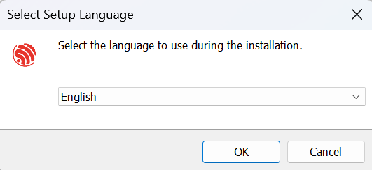

4. 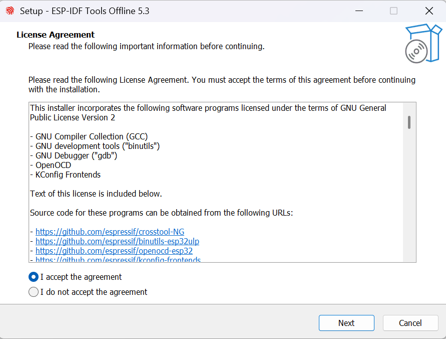

5. 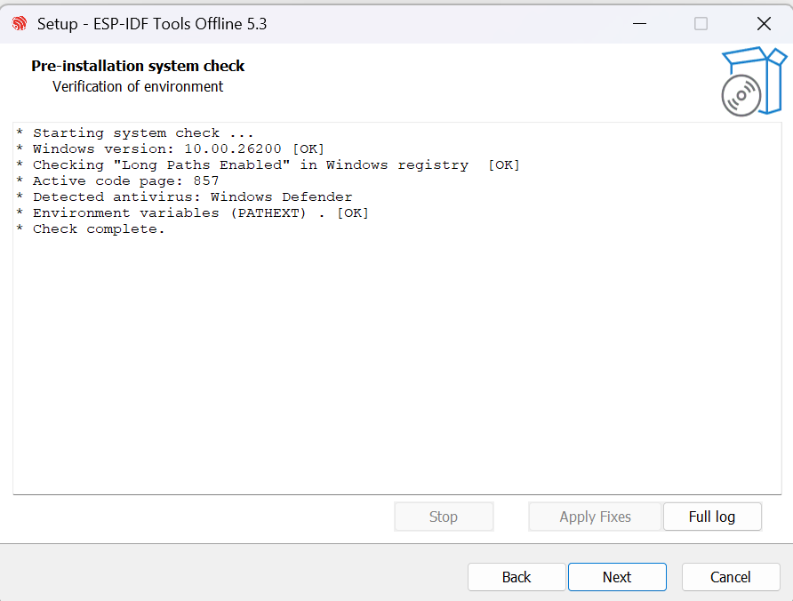

Press Apply Fixes if any.

6. 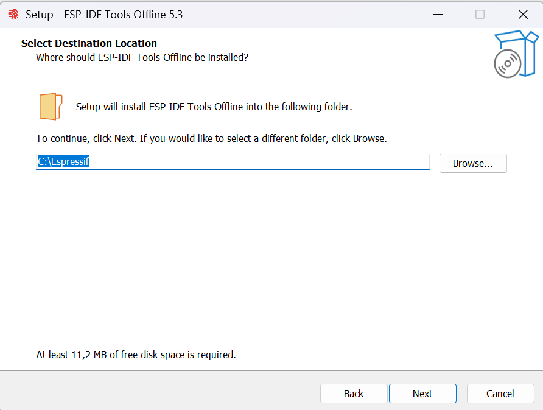

7. 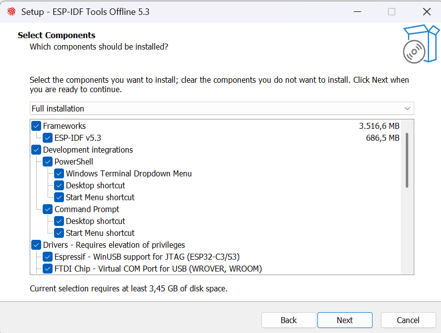

8. 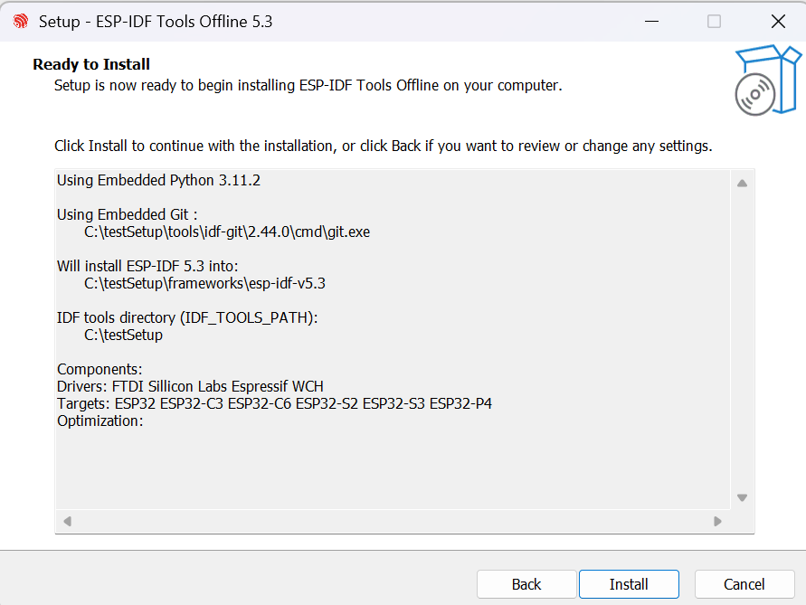

9. 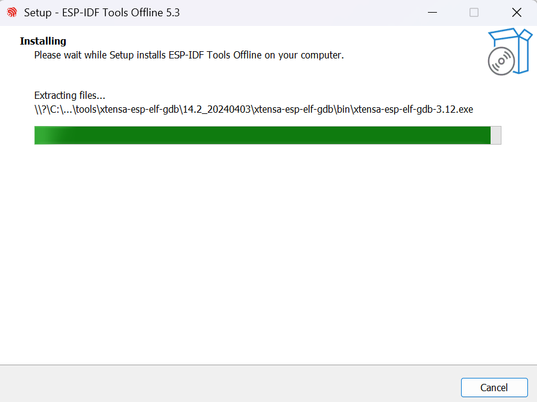

10. 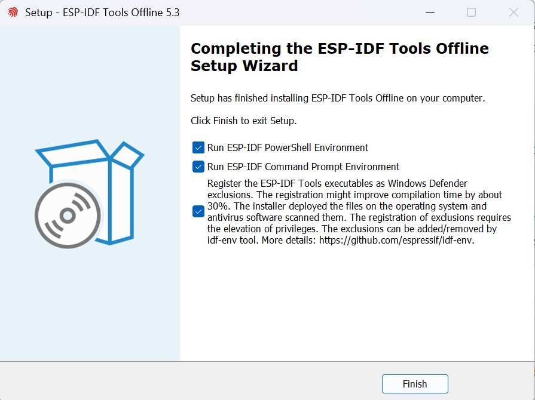  

11. Go into the directory you downloaded Espressif files.

12. run cmd under <setup path>\frameworks\esp-idf-v5.3, by default it is C:\Espressif\frameworks\esp-idf-v5.3

13. Inside the terminal run install.bat

14. After that run export.bat

15. Once these are completed, your terminal is ready to play with ESP projects.

16. Change directory to the Workshop project that you have cloned.

### 7.2 macOS / Linux

#### Step 1 — Install required packages

**Linux:**
```bash
sudo apt-get install git wget flex bison gperf python3 python3-pip python3-venv cmake ninja-build ccache libffi-dev libssl-dev dfu-util libusb-1.0-0
```

**macOS:**
```bash
brew install cmake ninja dfu-util
```

#### Step 2 — Verify Python 3

```bash
python --version
```

Python 3.x must be installed.

If Python is not installed on macOS:
```bash
brew install python3
```

#### Step 3 — Clone ESP-IDF

```bash
mkdir -p ~/esp
cd ~/esp
git clone -b v5.3 --recursive https://github.com/espressif/esp-idf.git
```

**ESP-IDF repository:** [https://github.com/espressif/esp-idf.git](https://github.com/espressif/esp-idf.git)

#### Step 4 — Install required tools

```bash
cd ~/esp/esp-idf
./install.sh esp32
```

This installs the compiler, debugger, and required Python packages.

#### Step 5 — Set environment variables

```bash
. $HOME/esp/esp-idf/export.sh
```

You can then enter the project folder and run:

```bash
idf.py build
```

A successful build confirms that the installation is complete.

---

## 8. Installation Verification

Run the following commands to verify your ESP-IDF setup:

### Check ESP-IDF version
```bash
idf.py --version
```
You should see **v5.3** in the output.

### Check Python version
```bash
python --version
```
You should see Python 3.8 or newer.

### Check compiler
```bash
xtensa-esp32-elf-gcc --version
```
This shows the ESP32 cross-compiler version.

---

## Useful Commands

Common commands used during ESP32 development:

| Action | Command |
|--------|---------|
| Build project | `idf.py build` |
| Clean project | `idf.py fullclean` |
| Flash firmware | `idf.py flash` |
| Open serial monitor | `idf.py monitor` |
| Build, flash, and monitor | `idf.py build flash monitor` |
| Open configuration menu | `idf.py menuconfig` |

**Flash and monitor with serial port:**

```bash
idf.py -p COM3 flash monitor          # Windows
idf.py -p /dev/ttyUSB0 flash monitor  # Linux
idf.py -p /dev/cu.usbserial-* flash monitor  # macOS
```

To exit the monitor, press `Ctrl + ]`.

---

## Resources

### Official documentation
- [ESP-IDF Programming Guide](https://docs.espressif.com/projects/esp-idf/en/v5.3/esp32/index.html)
- [ESP32 Technical Reference](https://www.espressif.com/sites/default/files/documentation/esp32_technical_reference_manual_en.pdf)
- [ESP-IDF GitHub Repository](https://github.com/espressif/esp-idf)

### Useful links
- [ESP32 Forum](https://esp32.com/)
- [Espressif GitHub Examples](https://github.com/espressif/esp-idf/tree/master/examples)
- [ESP-IDF VS Code Extension](https://marketplace.visualstudio.com/items?itemName=espressif.esp-idf-extension)

---

## Setup Complete ✓

Once all tools are installed, proceed to the workshop activity.

### ↳ [Start Activity — Running the Project](Project/RunningCode.md)

---

<p align="center">
  <sub>© Empa Electronics — Tiremo® Accelerator Workshops</sub>
</p>
